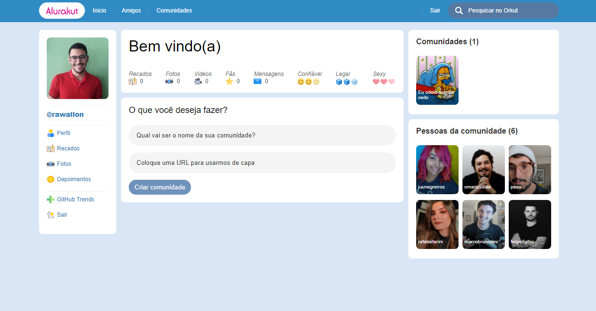

<div align="center">
  
</div>
<br/>
<hr />
<h5 align="center">Imersão React promovida pela Alura.</h5><br/>

## Demo
<a title="Deployed with vercel" href="https://alurakut-sand-phi.vercel.app/">

</a>

## Technologias

 - [React](https://reactjs.org)
 - [Next.JS](https://nextjs.org/)
 - [Styled components](https://styled-components.com/)
 - [Vercel](https://vercel.com/)

 
## Screenshot
	


## Rodando localmente

Antes de começar você precisa do [Git](https://git-scm.com) e [Node](https://nodejs.org/en/) instalado.

```bash

# Clone o repositorio
$ git clone https://github.com/rawallon/alurakut.git && cd alurakut

# Instale as dependencias
$ npm install

# Inicie o servidor
$ npm run dev
```